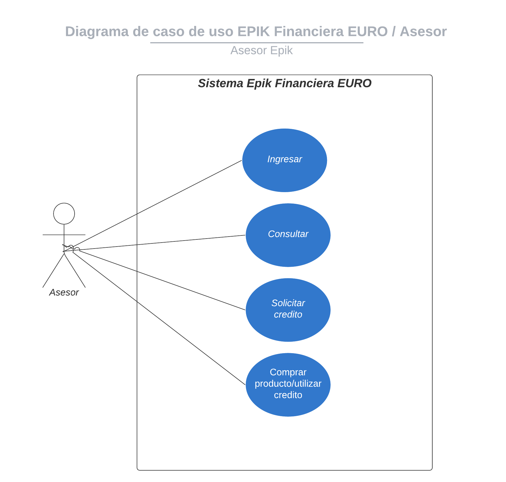

# 2.2.1 ROL ASESOR

**USUARIO ASESOR**

* **Ingresar/Log-In:** Se encargara del ingreso al aplicativo
* **Consultar usuario:** Se encargara de realizar la consulta del usuario en la base de datos, verificando si este se encuentra pre aprobado, rechazado o sin analizar.
* **Solicitar crédito:** Se encargara de realizar el proceso de la solicitud del crédito en el cual, se solicitaran los datos y capturas de documento y rostro para su verificación en las diferentes entidades requeridas para su aprobación. 
* **Comprar:** Se encargara de realizar el proceso de la compra o uso del crédito aprobado verificando el valor, cuotas, formalización de documentos, firma y aceptación del pagare del crédito.

### Diagrama de casos de uso

### 🗂 Descripción de casos de uso

| Identificador de caso de uso | Nombre | Descripción | Detalle |
| :--- | :--- | :--- | :--- |
| CU1 | Ingresar | Permite ingresar al aplicativo | [Aquí]() |
| CU2 | Consultar | Permite realizar la consulta del estado de un usuario en la base de datos del sistema | [Aquí]() |
| CU3 | Solicitar crédito | Permite realizar la solicitud de un crédito, autorización de tratamiento de datos, captura de imágenes y verificación de identidad. | [Aquí]() |
| CU4 | Comprar | Permite realizar la compra o utilizar el crédito aprobado, verificación de da tos del crédito, firma y aceptación de pagare. | [Aquí]() |

[Para regresar a funcionalidades del producto pulse Aquí. ](./)



