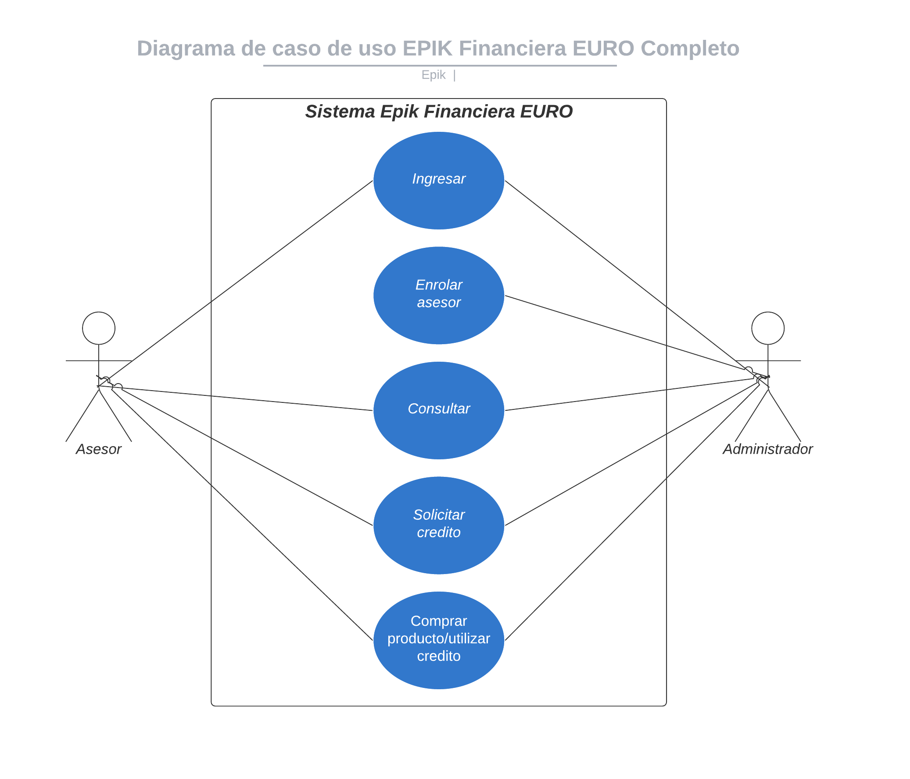

# 2.2	Funcionalidad del producto

El aplicativo actualmente cuenta con funcionalidades para el usuario asesor y usuario administrador a continuación se detallan todas las funcionalidades principales del aplicativo epik financiera Euro.

* **Ingresar/Log-In:** Se encargara del ingreso al aplicativo
* **Enrolar:** Se encargara de enrolar o asignar la imagen facial de un asesor, para su autenticación. 
* **Consultar usuario:** Se encargara de realizar la consulta del usuario en la base de datos, verificando si este se encuentra pre aprobado, rechazado o sin analizar.
* **Solicitar crédito:** Se encargara de realizar el proceso de la solicitud del crédito en el cual, se solicitaran los datos y capturas de documento y rostro para su verificación en las diferentes entidades requeridas para su aprobación. 
* **Comprar:** Se encargara de realizar el proceso de la compra o uso del crédito aprobado verificando el valor, cuotas, formalización de documentos, firma y aceptación del pagare del crédito, para la realización del desembolso del dinero al cliente.

### Diagrama de casos de uso sistema

### Detalle de casos de Uso por Rol de usuario:

* [2.2.1 ROL ASESOR](2.2.1-rol-asesor/)
* [2.2.2 ROL ADMINISTRADO](2.2.2-rol-administrador/)



