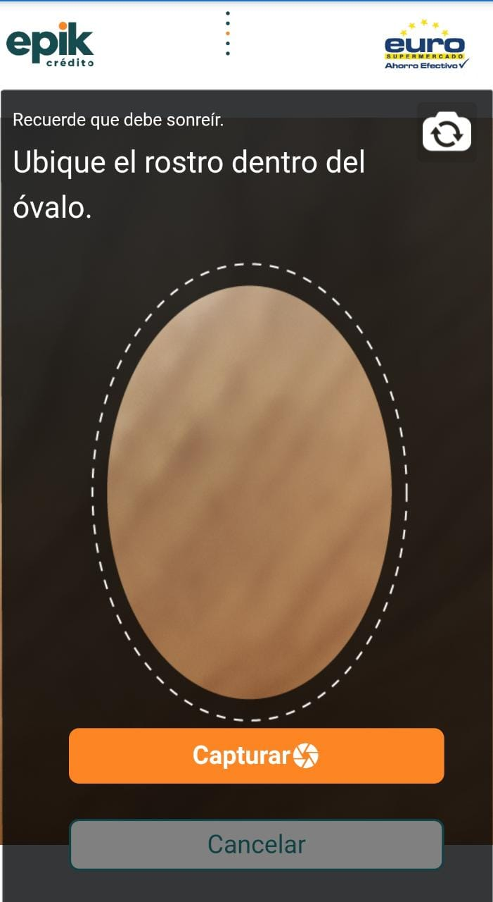

# 💻Acceso a aplicativo

1. Ingresar a la siguiente URL: [https://epikfinancierav02.web.app/](https://epikfinancierav02.web.app/)

2. Seleccione la opción _"Consultar Cliente"_.


3. Si el tipo de usuario que ingresa es "Asesor", solicitara la validación facial que se describe a continuación: 


3. Ingrese sus credenciales de acceso \(Usuario y Contraseña\), luego seleccione el botón "Ingresar".

4. Seleccione el botón 🖱 _**"continuar"**_.

5. Ubique su rostro en el ovalo y seleccione le botón 🖱 _**"Continuar"**_, para acceder al aplicativo.

### Video de ingreso al aplicativo



#### Si desea conocer el [Flujo normal de la aplicación](flujo-normal-de-la-aplicacion-asesor/) puede acceder acá:



