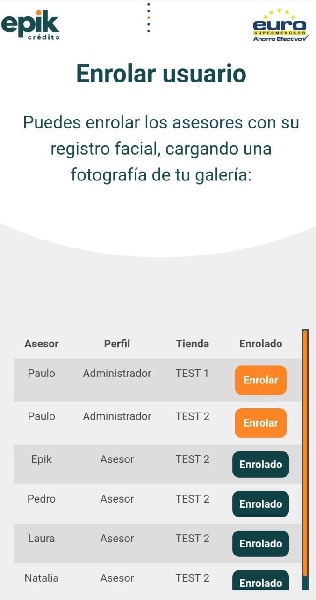

# 👨‍✈️Flujo normal de la aplicación \(Administrador\)

En este apartado se puede visualizar las dos funcionalidades, "el flujo de enrolar un asesor en el aplicativo" y "el flujo de realizar la consulta, aprobación exitosa de el monto del crédito y la compra exitosa o crédito aprobado".

#### Flujo de enrolado de asesor exitoso.

1.  Seleccione la funcionalidad deseada, para este caso se piensa enrolar un asesor.


Si el administrador desea **"Iniciar un proceso"**, puede ver el flujo normal de la aplicación pulsando ["Aquí"](flujo-normal-de-la-aplicacion-asesor/).


2. Seleccione el botón 🖱 de _**"Enrolar Asesores"**_.

3. Dentro de la tabla de nombres, busque el asesor a enrolar y seleccione en la parte derecha del mismo el botón 🖱 _**"Enrolar".**_

4. Seleccione el botón 🖱 _**"Cargar desde archivo".**_

5. Aparecerá su galería de fotos o el gestor de archivos, seleccione la foto o imagen del asesor para vincular su registro facial, luego seleccione el botón 🔘 _**"Listo"**_  en su celular". 


6. Si el proceso se realizo correctamente, el asesor en su parte derecha habrá cambiado el botón 🖱 naranja de _**"Enrolar"**_ a azul _**"Enrolado".**_


