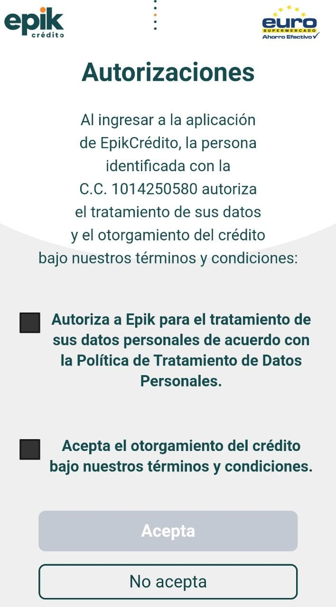
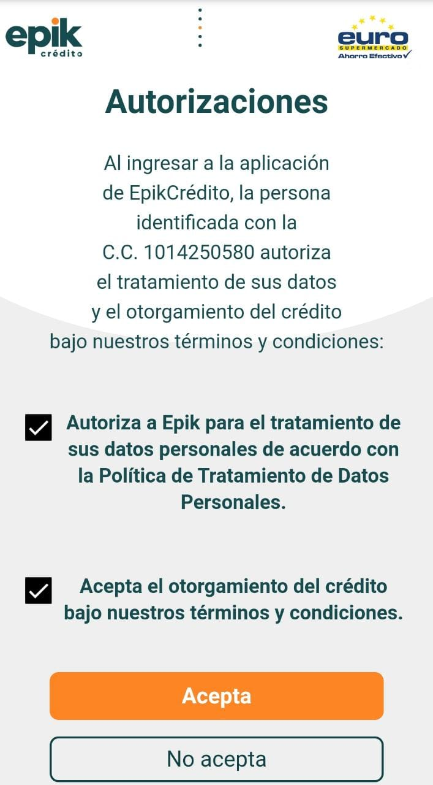

# Autorización de datos


En esta pantalla se visualiza en el caso de que 

-El usuario tiene o no un crédito pre aprobado.

-Si este no cuenta con el análisis inicial o es primera vez consultado.


5.	Marque las casillas ✅ de autorización de tratamiento y consultas de datos.

6.	Seleccione el botón 🖱 _**“Acepta”**_**.**



