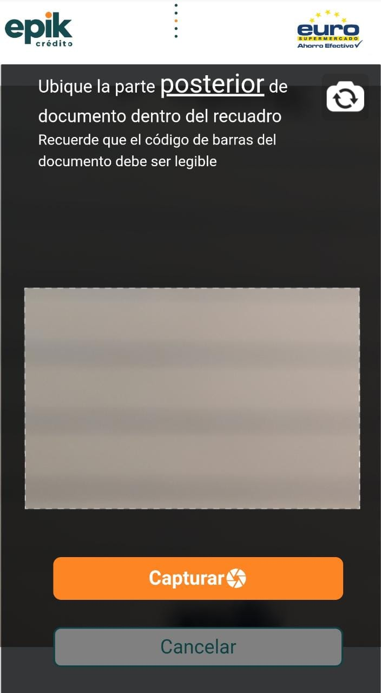

# Captura posterior documento

11.	Ubique en la cámara 📷 la parte trasera del documento del cliente, luego seleccione el botón 🖱 de _**“capturar”.**_ Aparecerá la ventana de validación de identidad. 



