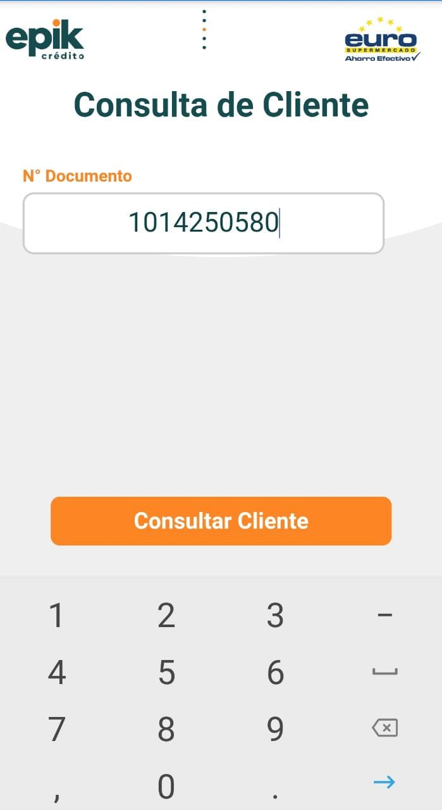

# Consulta

1. En la casilla 🔡 _**“N° Documento”**_**,** diligenciar el numero de documento del cliente a consultar.

2. Seleccionar el botón 🖱 _**“Consultar cliente”**_

3. Si el cliente cuenta con un crédito [pre aprobado continúe el flujo "Aquí"](pre-aprobado.md) , de lo contrario pase a la sección ["Autorización de datos"](autorizacion-de-datos.md).

