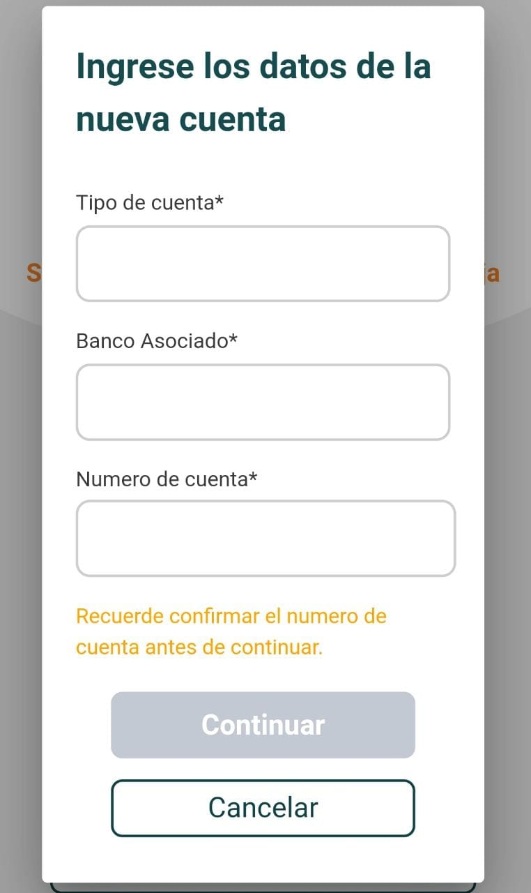

# Ingrese datos de la nueva cuenta

1 . Ingrese los datos de la nueva cuenta "Tipo de cuenta, Banco asociado, Numero de cuenta".

2. Seleccione el botón 🖱 _**"Continuar".**_

3. Seleccione el botón 🖱 _**"Saltar este paso".**_



