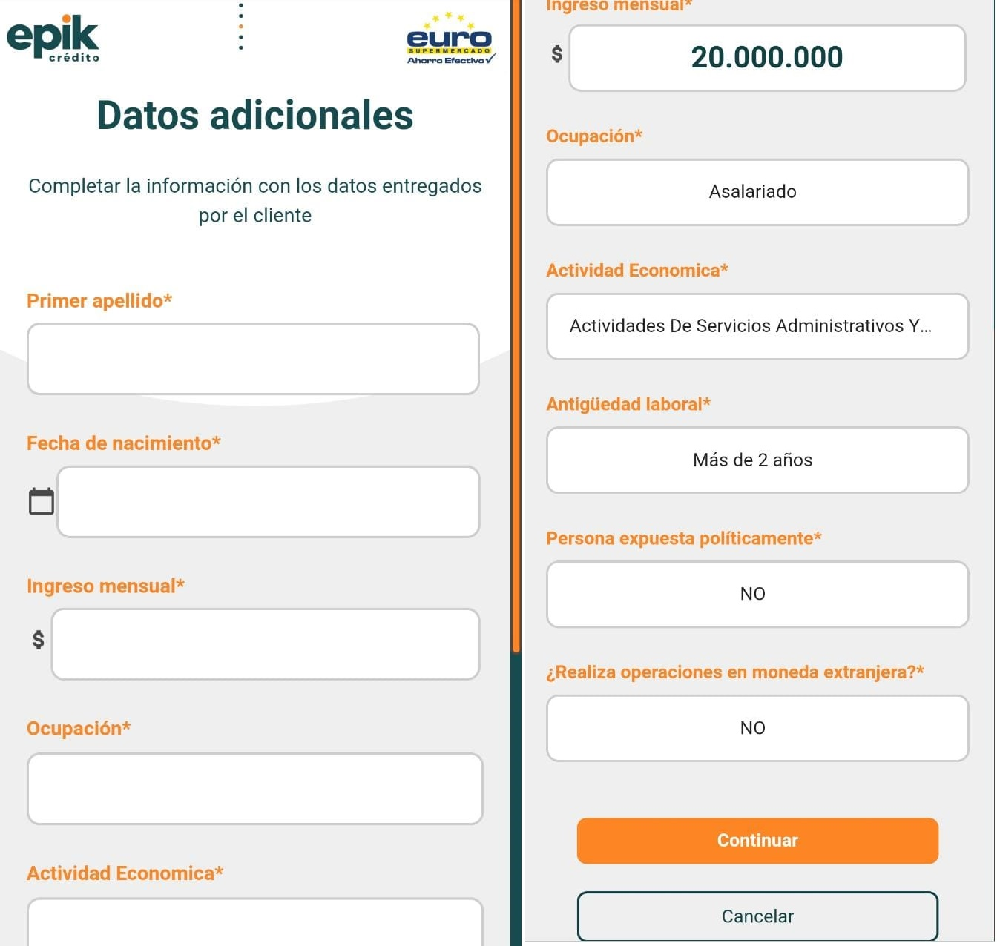

# Datos adicionales

13.	Diligencie completamente los datos del formulario 📄 \(Primer apellido, Fecha de nacimiento, ingreso mensual, ocupación, actividad económica, antigüedad laboral, persona expuesta políticamente, ¿realiza operaciones en moneda extranjera? \) que se muestra a continuación:

14.	Una vez están completos los datos seleccione el botón 🖱 _**“continuar”**_**.**

\*\*\*\*



