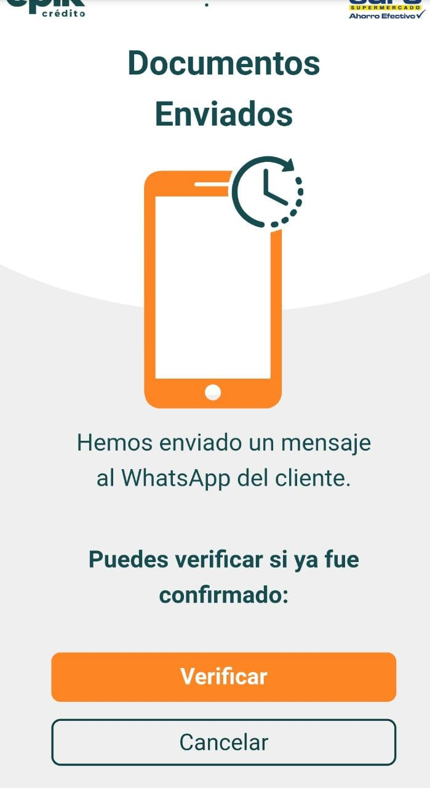
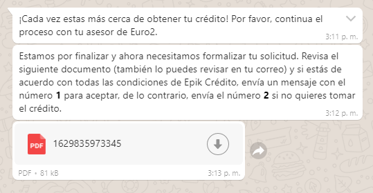
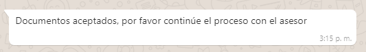

# Documentos enviados

28. El usuario recibirá el siguiente mensaje de texto en su celular vía WhatsApp y en su correo electrónico, junto con el documento en PDF el cual debe revisar para luego responder el mensaje de aceptación con el numero _**"1"**_. 


Si desea ver el contenido de ejemplo del PDF seleccione [_**"Aquí"**_](documento-formalizacion-ejemplo-pdf.md)_\*\*\*\*_


29.	Una vez el cliente ha verificado los documentos recibirá el siguiente mensaje vía **WhatsApp** confirmando la aceptación de la formalización.

30. Luego de confirmar que el usuario acepto la formalización, regrese a la aplicación del asesor y seleccione el botón 🖱 _**“Verificar”**_**,** para continuar con el proceso.



