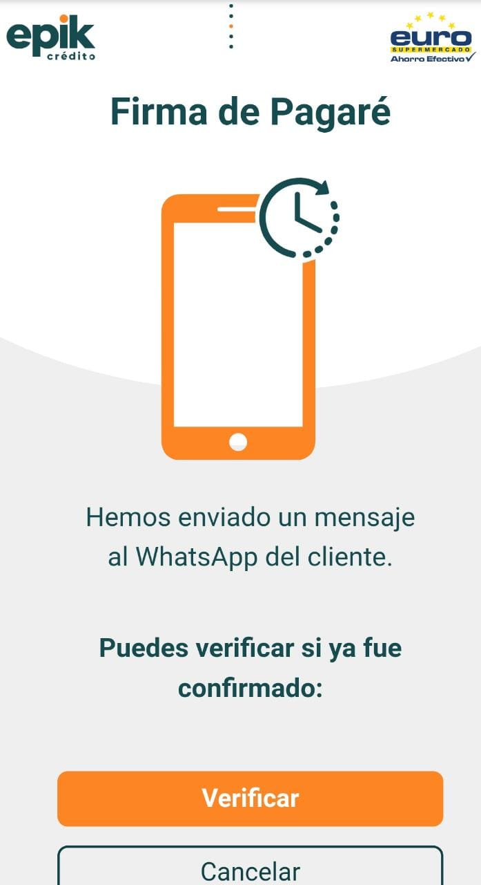
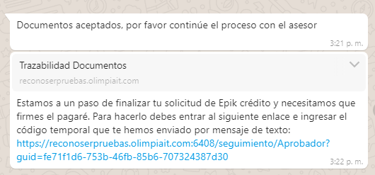
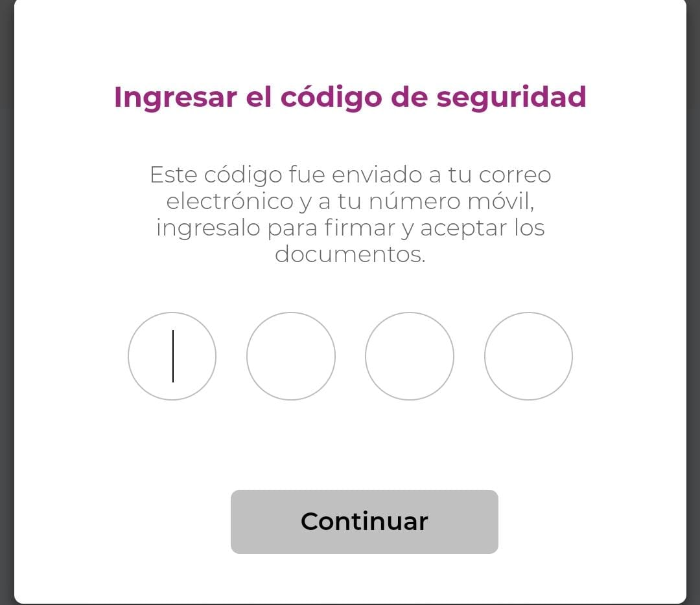
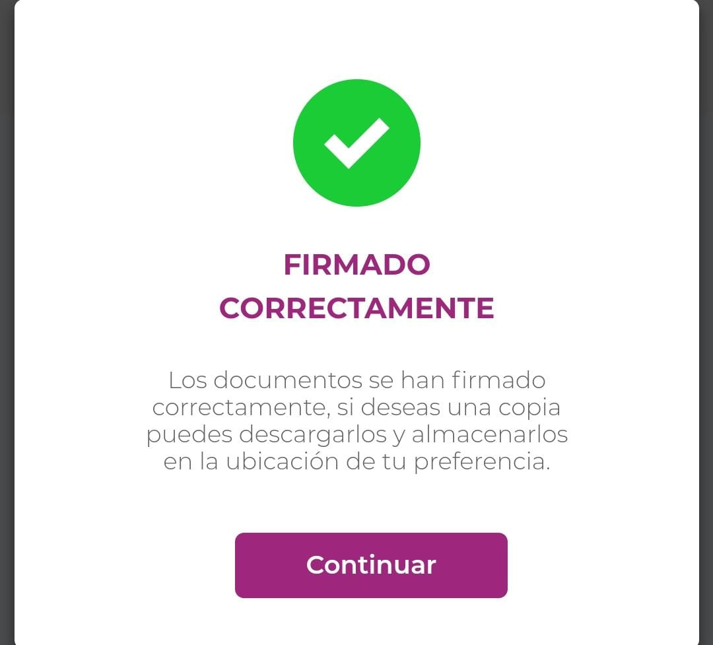

# Firma pagare \(Olimpia\)

31.	Ahora se procederá a realizar la firma del pagare, el cliente recibirá el siguiente mensaje de **WhatsApp**, en el cual viene el enlace a la pagina de "**OLIMPIA**" para la firma virtual, al cual debe acceder.

32. Al acceder al enlace se dirigirá a una pagina de terceros "Olimpia", en la cual se encontrara con la siguiente pantalla, en la cual debe seleccionar el botón 🖱  _"**Continuar"**_ una vez entienda y lea el mensaje.


33. El usuario debe leer completamente el documento que aparece en la pagina "firmamos by Olimia IT", con el numero de aprobación, el cual mostrara en pantalla el _**"**_**Pagare único personal"**_**.**_


34. Luego de leer el pagare y si el usuario esta de acuerdo, deberá seleccionar ☑ la totalidad de los documentos a firmar y luego seleccionara el botón __🖱 _**" Firma y acepta".**_ 

35. Sera enviado vía correo electrónico y mensaje de texto un código de verificación de **4 dígitos** único generado.

36. Debe diligenciar dicho código en la pantalla del **PIN** de Olimpia y luego seleccionara el botón 🖱 _**"Continuar".**_

37. Si el proceso continuo satisfactoriamente deberá aparecer una pantalla de "Firmado correctamente" y luego seleccionara el botón 🖱 _**"Continuar".**_

38. Una vez que el cliente haga el proceso en su celular 📲 y confirme el pagare, vuelva a la pantalla del **Asesor** y seleccione el botón 🖱 de _**“Verificar”**_, para continuar con el proceso.



