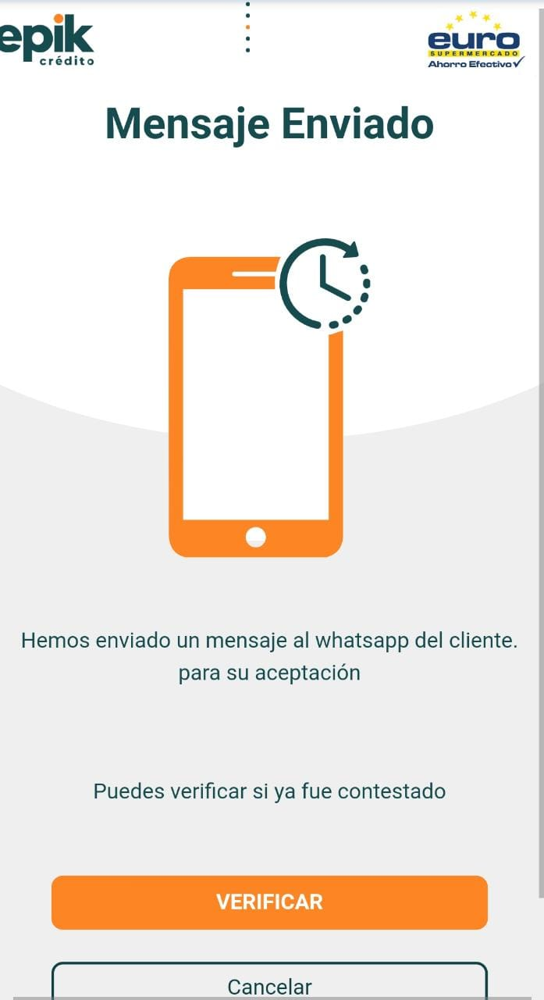
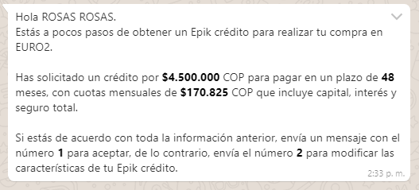
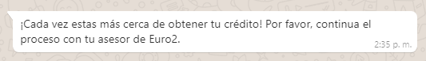

# Mensaje enviado \(confirmación de cuentas\)


**22. El usuario recibirá el siguiente mensaje vía WhatsApp** 📲 **, en el cual debe responder con el numero** **"1"**.


23.	Si el cliente responde el mensaje con el numero **"1",** llegará el siguiente mensaje de aceptación de la confirmación. 

24. Una vez el cliente ha aceptado ☑ o confirmado la información enviada seleccione el botón 🖱 _**“Verificar”**_



