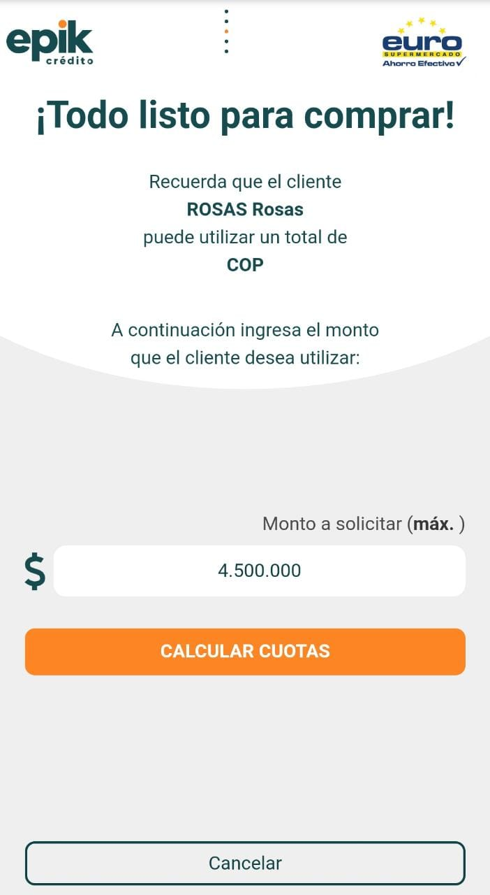

# Todo listo para comprar

18.	Diligencie la casilla 📄 _**“Monto a Solicitar”**_, luego seleccione el botón 🖱 _**“Calcular Cuotas”**_

19.	Seleccione de la primera lista 📄 desplegable el "_número de cuotas" y "valor deseado"_.

20.	Seleccione de la segunda lista 📄 desplegable la "_fecha de recaudo"_ que el cliente solicite.

21.	Seleccione el botón 🖱 _"Confirmar cuotas"_.



